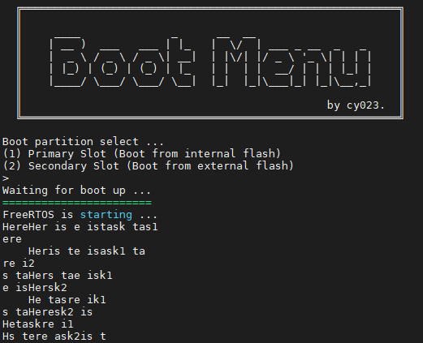

# FreeRTOS practice

## LED blink
LED0 閃爍頻率: 1/3 (toggle/s)

LED1 閃爍頻率: 1/2 (toggle/s)

- 測試程式: `UnitTest/test_freertos_00_led.c`

## Preemptive vs. Non-Preemptive (Co-Operative)
兩個同樣優先級的任務，分別印出不同的字串，測試在搶佔模式與非搶占模式下的輸出結果。

- 測試程式: `UnitTest/test_freertos_01_preemption.c` 並分別將 `Config/FreeRTOSConfig.h` 中的 `configUSE_PREEMPTION` 開啟與關閉測試搶佔模式與非搶占模式。
- Task1: 藉由 UART 將字串 'Here is task1\r\n' 送到終端機
    ```c
    void task1()
    {
        while (1) {
            usart_puts("Here is task1\r\n");
        }
    }
    ```
- Task2: 藉由 UART 將字串 'Here is task2\r\n' 送到終端機
    ```c
    void task2()
    {
        while (1) {
            usart_puts("Here is task2\r\n");
        }
    }
    ```

### Preemptive


兩個優先級相同的任務互相搶占，未將完整字串印出就被另一任務打斷。

### Non-Preemptive (Co-Operative)
任務內皆是永久迴圈，先進入的任務若無改變狀態 (Suspend, Block ...)，會持續執行，其他任務無法被執行。


### Non-Preemptive 模式下使用 TaskYIELD 強制讓出執行權

在前一個 Non-Preemptive 案例中，只有一個任務會被執行，我們可以在印出完整字串後將執行權讓出，使得兩個任務輪流執行。
在此，每印完一次字串就呼叫 `taskYIELD()`， 強制上下文交換 (Context Switch)，讓出 CPU 使用權。

```c
void task1()
{
    while (1) {
        usart_puts("Here is task1\r\n");
        taskYIELD();
    }
}
```
```c
void task2()
{
    while (1) {
        usart_puts("Here is task2\r\n");
        taskYIELD();
    }
}
```

終端機輸出結果的確為兩任務輪流被執行。


### Preemptive 模式下使用 Semaphore 保護 UART 資源
搶占模式下即可保護 UART 資源，讓優先級相同的兩任務交互執行。

